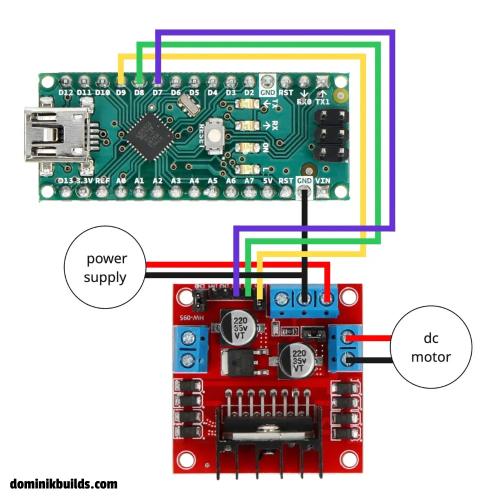

https://youtu.be/_AH3XQk81wg

## Overview

Learn how to connect and control DC motors with Arduino using an L298N motor driver. This tutorial covers the module's pinout, external power wiring, forward/reverse rotation, and speed control with pulse width modulation (PWM).

Key topics covered:

- **L298n overview:** driver internals explained.

- **Diagram:** pinout and wiring explained.

- **Direction control:** switching between forward, reverse, coasting, and braking.

- **PWM speed control:** adjusting the motor's power with PWM.

- **Code examples:** explained line by line

- **Troubleshooting:** diagnosing motors that won't start etc.

---

## Understanding the L298N motor driver

The [L298 from STMicroelectronics](https://www.st.com/en/motor-drivers/l298.html) contains two H-bridges. Each bridge switches the polarity across one motor, so you can drive two motors independently in either direction.

Arduino supplies the control signals. The external supply provides the motor power. Never connect a motor directly to an Arduino I/O pin.

The module exposes these connections:

| Connection     | Purpose                                      |
| :------------- | :------------------------------------------- |
| `OUT1`, `OUT2` | Motor A terminals                            |
| `OUT3`, `OUT4` | Motor B terminals                            |
| `IN1`, `IN2`   | Motor A direction                            |
| `IN3`, `IN4`   | Motor B direction                            |
| `ENA`, `ENB`   | PWM control for motors A and B               |
| `VCC`          | Positive motor supply input; labeling varies |
| `GND`          | Shared motor supply and logic ground         |
| `5V`           | Regulator output                             |

---

## Wiring the L298N to Arduino



| L298N connection       | Connect to                          |
| :--------------------- | :---------------------------------- |
| `ENA` (jumper removed) | Arduino `D9` (PWM)                  |
| `IN1`                  | Arduino `D8`                        |
| `IN2`                  | Arduino `D7`                        |
| `OUT1`, `OUT2`         | The DC motor's two wires            |
| Motor supply input     | External motor supply positive      |
| `GND`                  | Common ground                       |
| `ENB` (jumper removed) | `GND` to disable the unused channel |

Only channel A is used in the example.

---

## Controlling motor direction

For the motor on channel A, direction depends on `IN1` and `IN2`, while `ENA` enables or disables the bridge.

| Enable | Input 1 | Input 2 | Behavior                         |
| :----- | :------ | :------ | :------------------------------- |
| HIGH   | HIGH    | LOW     | Rotate in one direction          |
| HIGH   | LOW     | HIGH    | Rotate in the opposite direction |
| HIGH   | LOW     | LOW     | Brake                            |
| HIGH   | HIGH    | HIGH    | Brake                            |
| LOW    | Either  | Either  | Coast to a stop                  |

Coasting disables the bridge; braking electrically resists rotation.

"Forward" depends on your motor wiring and mounting. If a wheel turns the wrong way, disconnect power and swap that motor's two output wires, or invert its direction in code.

---

## How PWM speed control works

PWM repeatedly switches an output on and off. Its duty cycle is the fraction of time the signal stays high. Arduino's [`analogWrite()`](https://docs.arduino.cc/language-reference/en/functions/analog-io/analogWrite/) uses values from `0` to `255` by default:

| Value | Duty cycle | Effect with PWM on `ENA`                |
| :---- | :--------- | :-------------------------------------- |
| `0`   | 0%         | Disable the bridge and coast            |
| `128` | About 50%  | Apply power for roughly half each cycle |
| `255` | 100%       | Keep the bridge enabled                 |

This tutorial uses `D9` for speed, leaving `D8` and `D7` as ordinary digital direction outputs. See Arduino's [PWM explanation](https://docs.arduino.cc/tutorials/generic/secrets-of-arduino-pwm/).

A duty cycle of 50% does not guarantee half the motor's maximum revolutions per minute (RPM). Speed also depends on load, supply voltage, and friction. Measuring and maintaining a target RPM requires feedback, such as an encoder. At a low duty cycle, a motor can hum without starting; test with a moderate value first.

---

## Arduino code for one DC motor

No additional library is required. These two sketches use the same pin mapping as the diagram. Upload one sketch at a time, and open Serial Monitor at `9600` baud to see the messages.

Both sketches are also available on my [source repository](https://github.com/mcdominik/source/tree/main/arduino/dc_motor_tutorial) on GitHub.

### Forward, stop, and reverse

The basic movement sketch runs the motor forward at full power for three seconds, coasts for 300 ms, runs in reverse for three seconds, and coasts again. The sequence repeats.

```cpp
// forward at full speed
// stop
// reverse at full speed
// stop

const int ENA = 9;
const int IN1 = 8;
const int IN2 = 7;

void setup() {
  pinMode(ENA, OUTPUT);
  pinMode(IN1, OUTPUT);
  pinMode(IN2, OUTPUT);

  Serial.begin(9600);
}

void loop() {
  Serial.println("Forward - full speed");
  digitalWrite(IN1, HIGH);
  digitalWrite(IN2, LOW);
  analogWrite(ENA, 255); // 0 - 255
  delay(3000);

  Serial.println("Stop");
  analogWrite(ENA, 0);
  delay(300);

  Serial.println("Reverse - full speed");
  digitalWrite(IN1, LOW);
  digitalWrite(IN2, HIGH);
  analogWrite(ENA, 255);
  delay(3000);

  Serial.println("Stop");
  analogWrite(ENA, 0);
  delay(300);
}
```

`analogWrite(ENA, 255)` keeps channel A enabled at full duty cycle. `analogWrite(ENA, 0)` disables the bridge so the motor coasts. Increase both `delay(300)` stop intervals before testing if the motor keeps turning during the pause.

### Accelerate and decelerate in steps

The acceleration sketch keeps the motor in the forward direction and steps through approximately 25%, 50%, 75%, and 100% duty cycle. It then steps back down to zero and repeats.

```cpp
// Accelerate in 4 steps
// Decelerate in 4 steps


const int ENA = 9;
const int IN1 = 8;
const int IN2 = 7;

void setup() {
  pinMode(ENA, OUTPUT);
  pinMode(IN1, OUTPUT);
  pinMode(IN2, OUTPUT);

  Serial.begin(9600);
}

void loop() {
  // Set forward direction
  digitalWrite(IN1, HIGH);
  digitalWrite(IN2, LOW);

  // Accelerate in 4 steps
  Serial.println("Speed: 25%");
  analogWrite(ENA, 64);
  delay(500);

  Serial.println("Speed: 50%");
  analogWrite(ENA, 128);
  delay(500);

  Serial.println("Speed: 75%");
  analogWrite(ENA, 192);
  delay(500);

  Serial.println("Speed: 100%");
  analogWrite(ENA, 255);
  delay(1000);

  // Decelerate in 4 steps
  Serial.println("Speed: 75%");
  analogWrite(ENA, 192);
  delay(500);

  Serial.println("Speed: 50%");
  analogWrite(ENA, 128);
  delay(500);

  Serial.println("Speed: 25%");
  analogWrite(ENA, 64);
  delay(500);

  Serial.println("Speed: 0%");
  analogWrite(ENA, 0);
  delay(500);
}
```

The Serial Monitor messages say "Speed," but the percentages describe PWM duty cycle, not measured RPM. A motor that cannot start at `64` can hum or remain still until the next step applies more power. Test with the shaft unloaded.

The pauses make both demonstrations easy to follow. In a robot that also reads sensors or responds to commands, replace blocking `delay()` calls with timing based on `millis()`.

---

## Voltage drop and heat

The L298 uses bipolar transistors, which lose a substantial voltage across the bridge. Expect a total voltage drop 1.8–4 V, depending on the motor's current.

Don't treat a module's advertised "2 A per channel" as a guaranteed continuous working current. The chip lists 2 A per channel as an absolute maximum for DC operation; practical operation also depends on cooling and module construction. Check stall current and temperature, and stop testing if the driver overheats.

Don't compensate blindly by increasing supply voltage beyond the motor's rating. For low-voltage or battery-powered projects, choose a driver with lower losses and current protection suited to your motor.

Saved you some time? Support my work with a coffee. Thank you!

<a
  href="https://coff.ee/dominikbuilds"
  target="_blank"
  rel="noopener noreferrer"
>
  
</a>

---

## FAQ and troubleshooting

<details>
<summary>Why does my DC motor not spin?</summary>

Use a multimeter to check the external supply voltage and make sure all grounds are connected. Confirm that the motor is on `OUT1` and `OUT2`, and that `ENA`, `IN1`, and `IN2` connect to `D9`, `D8`, and `D7`. Check that the driver's logic has a stable 5 V supply. With power disconnected, use continuity mode to check your wires. Start with an unloaded motor and a moderate duty cycle.

</details>

<details>
<summary>Why does the motor always run at full speed?</summary>

Remove the `ENA` jumper; it holds the enable input high. Check that the signal wire connects to the exposed `ENA` input and Arduino `D9`. The basic movement sketch intentionally runs at full power. Upload the acceleration sketch to test changing the duty cycle.

</details>

<details>
<summary>Why does Arduino reset when the motor starts?</summary>

Motor startup can pull the supply voltage down or introduce electrical noise. Keep the motor supply separate from Arduino's USB power, connect a common ground, and check wiring.

</details>

<details>
<summary>Can I power the motor from Arduino's 5V pin?</summary>

No. Use an external power supply for the motor. Its startup and stall current can exceed what Arduino can supply and damage the board.

</details>

<details>
<summary>Why does my motor hum and buzz?</summary>

Humming or buzzing is normal when controlling a motor with PWM. At a low duty cycle, such as 25%, the motor may not produce enough average torque to rotate smoothly. The PWM pulses can also cause vibrations that produce an audible buzzing or squealing sound.

</details>

<details>
<summary>Can L298N control a servo motor?</summary>

A standard hobby servo already contains its own motor driver and position controller. Connect it to an appropriate power supply and an Arduino control signal instead. See the [Arduino servo motor tutorial](/posts/arduino-servo-motors/) for wiring and code.

</details>
