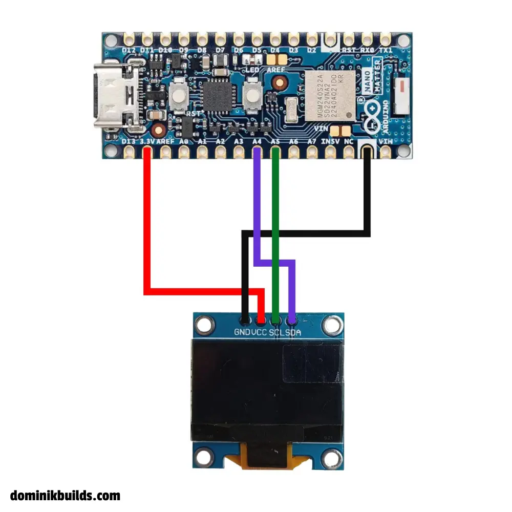
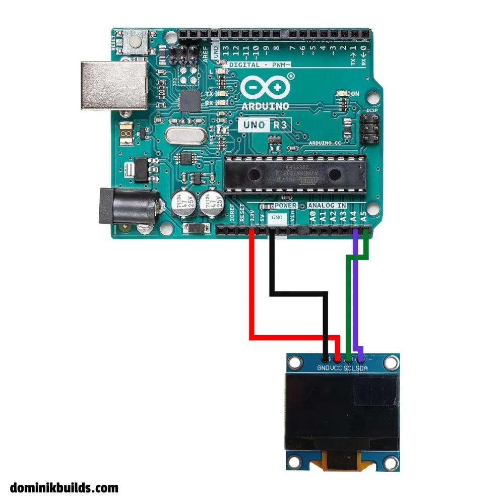

https://youtu.be/___p9JYbTc0

## Why Use an OLED Display with Arduino?

If you want to add a user interface, display sensor data, or create custom animations, an **OLED Arduino display** is one of the most popular and versatile components you can use. 

In this guide, I'll walk you through everything you need to know about setting up an OLED display with an Arduino, including how to draw basic text, geometric shapes, and scrolling animations. For the complete visual walkthrough and advanced bitmap image rendering, be sure to check out the accompanying video above!

## Understanding Your OLED Arduino Display

Before wiring anything, it's important to understand the hardware you are working with. There are a few common points of confusion:

- **3.3V vs 5V Logic:** Most of these displays can tolerate both 3.3V and 5V, so powering them is usually straightforward.
- **I2C vs SPI Communication:** Check the pins on your display. If your OLED has `SCL` and `SDA` pins, it uses **I2C**. If you see pins labeled `DC` or `CS`, it uses **SPI**. In this tutorial, we are focusing on the highly popular I2C version.
- **SSD1306 vs SH1106 Drivers:** Displays might look identical but use different drivers. I am using an SH1106 driver, but it runs perfectly fine using the standard SSD1306 library. Just keep in mind that the SH1106 has a 132-column wide RAM, while the SSD1306 is 128 columns wide. For basic text, it doesn't matter, but it's worth noting for precise animations.

## Wiring the OLED Display to your Arduino

For this project, I am using an [Arduino Nano 33 BLE Sense](https://docs.arduino.cc/hardware/nano-33-ble-sense/), but the wiring is exactly the same for the classic Arduino Uno or standard Arduino Nano.

Here is the standard I2C wiring pinout:

- **VCC** → Connect to 3.3V (or 5V depending on your board/display specs)
- **GND** → Connect to Ground
- **SCL (Serial Clock)** → Connect to Arduino **A5**
- **SDA (Serial Data)** → Connect to Arduino **A4**

*(Note: On standard Arduinos like the Uno and Nano, A4 and A5 are the dedicated I2C pins).*

### Arduino Nano OLED Wiring Diagram



### Arduino Uno OLED Wiring Diagram



## Arduino OLED Code: Displaying Basic Text

To get the display running, you first need to install two core libraries in your Arduino IDE:
1. `Adafruit GFX Library`
2. `Adafruit SSD1306`

Once installed, here is the basic code snippet to initialize the display and print your first text:

```cpp
#include <Wire.h>
#include <Adafruit_GFX.h>
#include <Adafruit_SSD1306.h>

#define SCREEN_WIDTH 128
#define SCREEN_HEIGHT 64

Adafruit_SSD1306 display(SCREEN_WIDTH, SCREEN_HEIGHT, &Wire, -1);


void setup() {
  // 0x3C is default i2c adress in some cases MAY be different
  display.begin(SSD1306_SWITCHCAPVCC, 0x3C);
  display.clearDisplay();
  display.setTextSize(2);
  display.setTextColor(WHITE);
  display.setCursor(10, 10);
  display.println("Subscribe");
  display.display();
}

void loop() {
}
```

## Advanced: Scrolling, Shapes, and Custom Bitmaps

The `Adafruit_GFX` library makes it incredibly easy to do much more than just print text:
- **Scrolling:** You can trigger built-in hardware scrolling using methods like `display.startscrollright(0x00, 0x0F)`.
- **Shapes:** Drawing triangles, circles, and lines only takes a single function call (e.g., `display.drawTriangle(...)`).
- **Custom Images:** You can display your own logos and graphics by converting normal photos into 1-bit monochrome byte arrays. 

I wrote a custom Python script that easily converts any image into a C-array that the Arduino can render using `display.drawBitmap()`. 

**Want to see exactly how to code the animations, draw complex shapes, and use the Python image converter? Watch the video at the top of the page for the full demonstration!**

You can also find all the advanced code snippets in the [project repository here](https://github.com/mcdominik/source/tree/main/arduino/oled_tutorial).

Want to make things move next? Check out my [Arduino servo motor tutorial](/posts/arduino-servo-motors/).

## FAQ

<details>
<summary>Why is my Arduino OLED display blank?</summary>

The most common cause is a wrong I2C address. Most displays use `0x3C`, but some use `0x3D`. Run the `i2c_scanner` sketch (File → Examples → Wire) to find the correct address. Also double-check that SDA goes to A4 and SCL to A5, and that you call `display.display()` after drawing.

</details>

<details>
<summary>How do I find the I2C address of my OLED display?</summary>

Upload the I2C scanner sketch and open the Serial Monitor. It will print the address of every connected I2C device. The address is sometimes also printed on the back of the display module.

</details>

<details>
<summary>Should I power the OLED display from 3.3V or 5V?</summary>

Most I2C OLED modules have an onboard voltage regulator and accept both. Use 3.3V on 3.3V boards (like the Nano 33 BLE Sense) and 5V on the Uno or classic Nano. If your module has no regulator, stick to 3.3V.

</details>

<details>
<summary>Does the SSD1306 library work with SH1106 displays?</summary>

For basic text and shapes, usually yes. The SH1106 has 132 columns of RAM instead of 128, so you may notice a 2-pixel offset or garbage on the edges. If that bothers you, use a dedicated SH1106 library such as `Adafruit SH110X` or `U8g2`.

</details>

<details>
<summary>What is the difference between I2C and SPI OLED displays?</summary>

I2C uses only two data wires (SDA and SCL) and is easier to wire. SPI uses more pins (MOSI, CLK, DC, CS, RST) but offers faster refresh rates, which matters for smooth animations.

</details>
