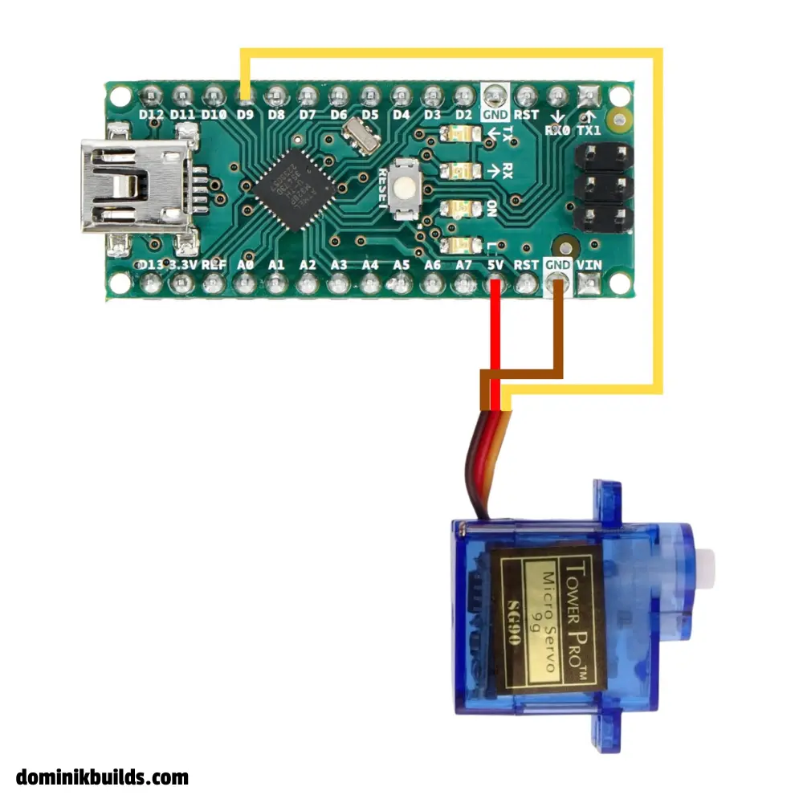
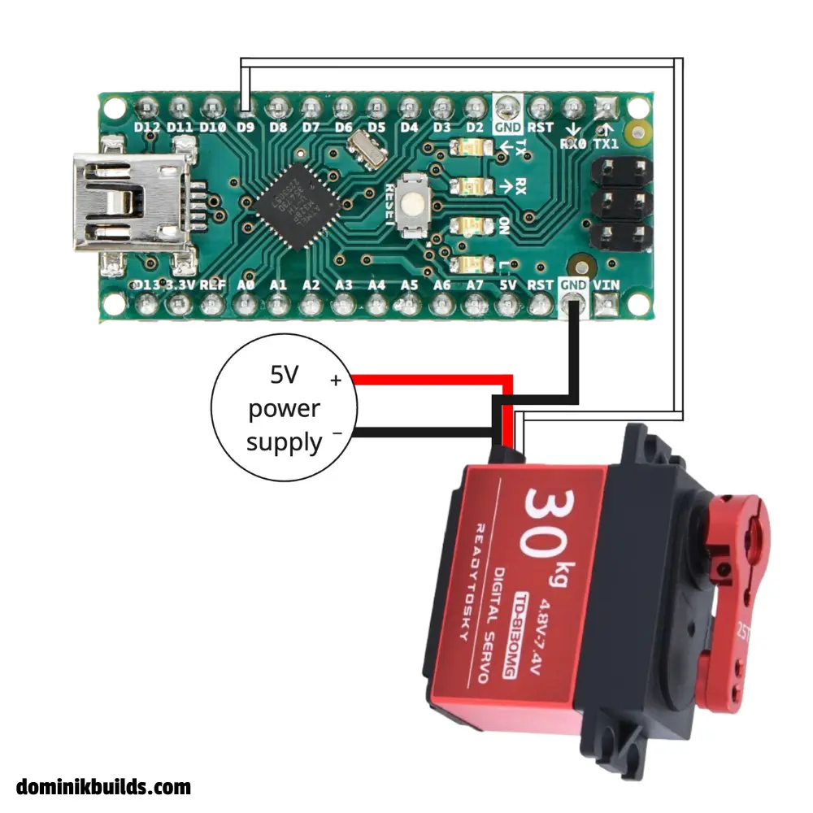

https://youtu.be/1mDnaiEytAI

## Overview

Learn how to connect and program any standard servo motor using an Arduino. Whether you are using a compact SG90 micro servo or a high-torque 30 kg metal-gear motor, the control principles remain the same. This guide covers safe power wiring, wire color schemes, pulse width modulation (PWM) fundamentals, and two core code examples: an automated sweep script and analog knob control with a potentiometer.

Key topics covered:

- **Safe powering** – why direct microcontroller power risks brownouts, and how to wire an external power supply.

- **Wire color codes** – standard pinouts across major servo manufacturers.

- **PWM fundamentals** – how duty cycles translate into rotational shaft positions.

- **Sweep script** – moving the servo back and forth across its travel limits.

- **Knob control** – mapping an analog potentiometer to real-time servo positions.

- **Capacitor decoupling** – eliminating voltage dips and unwanted motor jitter.

---

## Safe powering: direct vs. external power

Power distribution is the most critical factor when working with servo motors.

> **Warning:** Always use a dedicated external power supply for your servo motors. Electric motors draw substantial current spikes when starting or under mechanical load.
>
> Even a micro servo like the SG90 draws 0.5 A to 0.8 A at stall. Drawing that current directly from the Arduino 5V pin causes severe voltage dips, triggering the board's brownout detector and forcing an unexpected reboot. On older computers, it can even cause the host USB port to shut down.

For reliable operation, connect the servo power line directly to an external power supply (typically 5 V or 6 V, matching your motor specifications). Connect the power supply ground to the Arduino ground to establish a shared electrical reference.

### Wire color codes

Hobby servo manufacturers generally follow one of two common wiring conventions:

| Connection | SG90 / Tower Pro style | Readytosky / Futaba style |
| :--- | :--- | :--- |
| Power (VCC) | Red | Red |
| Ground (GND) | Brown | Black |
| Signal (PWM) | Orange | White |

Always verify your servo's pinout in its datasheet before applying power.

---

## Wiring guide

The wiring diagrams below use an [Arduino Nano](https://docs.arduino.cc/hardware/nano/), but the pin connections (5V, GND, and digital pin 9) are identical on the Arduino Uno and other standard boards.

### Option 1: Direct wiring (bench testing only)

Use this method only for a single unloaded micro servo during brief bench tests:

- VCC to Arduino 5V
- GND to Arduino GND
- Signal to Arduino pin 9 (or any digital pin)



### Option 2: External power wiring (recommended)

Use this method for all production projects, loaded motors, and multi-servo setups:

- Servo power (VCC) to external power supply (+5V or +6V)
- Servo GND to external power supply GND and Arduino GND (common ground)
- Servo signal to Arduino pin 9



> **Tip:** Add an electrolytic capacitor (100 µF to 470 µF) directly across the servo power and ground rails near the motor. The capacitor acts as a local energy reservoir, smoothing out inductive spikes and preventing jitter.

---

## How pulse width modulation (PWM) works

Servos do not receive discrete digital packets or varying DC voltage levels. Instead, the microcontroller sends a repetitive square-wave signal known as **pulse width modulation (PWM)**.

A standard hobby expects a 50 Hz control signal, which corresponds to a 20 ms pulse period. The duration of the high pulse dictates the target position of the output shaft:

- **1.0 ms pulse** – positions the servo at 0 degrees.
- **1.5 ms pulse** – centers the servo at 90 degrees.
- **2.0 ms pulse** – positions the servo at 180 degrees.

The Arduino `Servo` library abstracts these pulse-timing details, allowing you to write target positions directly in degrees.

---

## Arduino servo code examples

### 1. Sweep script

This script sweeps the servo across its full 180-degree range in a continuous loop.

```cpp
#include <Servo.h>

Servo myServo;
int pos = 0;

void setup() {
  myServo.attach(9);
}

void loop() {
  // Sweep from 0 to 180 degrees
  for (pos = 0; pos <= 180; pos += 1) {
    myServo.write(pos);
    delay(15);  // Allow physical gearbox time to reach the target angle
  }

  // Sweep back from 180 to 0 degrees
  for (pos = 180; pos >= 0; pos -= 1) {
    myServo.write(pos);
    delay(15);  // Allow physical gearbox time to reach the target angle
  }
}
```

> **Note:** The `delay(15)` call is essential. Microcontrollers execute instructions in nanoseconds, but mechanical gears require tens of milliseconds to physically transit between angles. Removing the delay causes the motor to buzz or stutter in place.

If your servo does not reach its full physical range with the default timings (544 µs to 2400 µs), define explicit pulse limits when attaching the pin:

```cpp
myServo.attach(9, 500, 2500);
```

### 2. Knob control with a potentiometer

This script enables you to control the servo angle manually using an analog potentiometer.

#### Potentiometer wiring

- Left pin to common ground (GND)
- Center pin (wiper) to Arduino analog pin A0
- Right pin to Arduino 5V (use 3.3V on 3.3V boards to avoid over-voltage)

```cpp
#include <Servo.h>

Servo myServo;

const int potPin = A0;
int val;

void setup() {
  myServo.attach(9);
}

void loop() {
  val = analogRead(potPin);            // Read 10-bit analog voltage (0 to 1023)
  val = map(val, 0, 1023, 0, 180);     // Scale analog range to degrees (0 to 180)
  myServo.write(val);
  delay(15);                           // Allow physical motor to settle
}
```

The `map()` function scales the Arduino 10-bit analog-to-digital converter (ADC) reading (`0` to `1023`) to a valid angular position (`0` to `180` degrees).

To display the current servo angle on an external screen, see the [Arduino OLED display guide](/posts/arduino-oled-display/).

Saved you some time? Support my work with a coffee – thank you! ☕

<a href="https://coff.ee/dominikbuilds" target="_blank" rel="noopener noreferrer">
  
</a>

---

## FAQ and troubleshooting

<details>
<summary>Why is my servo twitching or jittering?</summary>

Servo jitter is almost always caused by an inadequate or noisy power supply. When a servo motor moves, it draws sharp current spikes that cause voltage drops across the power rail. To resolve jitter:

- Power the servo using an external 5 V or 6 V power source instead of the Arduino 5V pin.

- Place an electrolytic capacitor (100 µF to 470 µF) across the servo power (+ and -) rails.

- Ensure software libraries that disable interrupts (such as `SoftwareSerial`) are not interrupting the hardware timer used by the `Servo` library.

</details>

<details>
<summary>Why does my Arduino reset every time the servo moves?</summary>

When a motor initiates movement or encounters mechanical resistance, it draws stall current (between 0.5 A and 1.5 A depending on the model). The Arduino onboard voltage regulator and standard computer USB ports cannot supply this instantaneous current. The resulting voltage sag triggers the microcontroller's internal brownout detector, restarting the board. Supplying power through an external supply with a shared ground solves this issue.

</details>

<details>
<summary>Can I connect a servo motor to any Arduino pin?</summary>

Yes. Unlike `analogWrite()`, which requires dedicated hardware PWM pins marked with a tilde `~` (pins 3, 5, 6, 9, 10, and 11 on the Uno), the Arduino `Servo` library generates PWM pulses in software backed by internal hardware timers (Timer1 on the Uno and Nano). You can connect a servo signal line to any standard digital pin or analog pin configured as an output.

</details>

<details>
<summary>Why isn't my servo turning the full 180 degrees?</summary>

The default pulse width range in the Arduino `Servo` library spans from 544 µs (0°) to 2400 µs (180°). Budget and aftermarket servos often use wider timing windows (such as 500 µs to 2500 µs) to reach their mechanical stops. Calibrate the travel limits by passing minimum and maximum microsecond values to `attach()`:

`myServo.attach(pin, 500, 2500);`

</details>

<details>
<summary>Why do I need a common ground (GND) with an external power supply?</summary>

Voltage is a relative difference in electrical potential measured against ground (0 V). The Arduino outputs control pulses with high and low voltages referenced to its own GND pin. If the external power supply and the Arduino do not share a common ground line, there is no common reference point. The servo cannot reliably measure pulse transitions, leading to erratic twitching or zero response.

</details>

<details>
<summary>What is the difference between a standard 180° servo and a continuous rotation servo?</summary>

A standard servo moves to and holds a specific angular position between 0° and 180°. A continuous rotation (360°) servo replaces the internal position potentiometer with fixed resistors, turning the device into a variable-speed bi-directional motor. In code, `write(90)` halts motor rotation, while values closer to 0° or 180° dictate rotational speed and direction.

</details>


