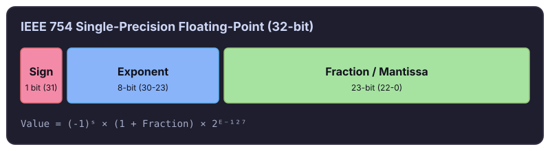

> **Warning:** Never use floating-point types (`FLOAT`, `DOUBLE`, or `REAL`) to store monetary values. Floating-point rounding errors cause calculation drift, corrupt account balances, and break financial audits.

Handling money in software seems straightforward until rounding errors creep into production. Whether building an e-commerce checkout, a billing pipeline, or an accounting ledger, you must store values precisely and prevent runtime conversion errors.

---

## Why you should never store money as a float

Binary floating-point numbers follow the [IEEE 754 standard](https://en.wikipedia.org/wiki/IEEE_754). In base 10, fractions like $1/10$ ($0.1$) and $2/10$ ($0.2$) are clean decimal values. But in base 2 (binary), $0.1$ is an infinite repeating fraction, similar to $1/3$ in base 10 ($0.3333\dots$). Because computers allocate finite memory to numbers, they truncate the repeating bits.

This truncation creates rounding discrepancies in common arithmetic:

```javascript
// JavaScript
console.log(0.1 + 0.2); // 0.30000000000000004
```

```python
# Python
print(0.1 + 0.2) # 0.30000000000000004
```

```rust
// Rust
println!("{:.17}", 0.1_f64 + 0.2_f64); // 0.30000000000000004
```

All three languages produce identical results because their runtimes implement standard IEEE 754 floating-point representations:

- **Single precision (`float`)** – Allocates 32 bits and provides roughly seven decimal digits of precision.

- **Double precision (`double`)** – Allocates 64 bits and provides roughly 15–16 decimal digits of precision.



A fractional difference like `$0.00000000000000004` appears harmless on a single transaction. Over thousands of calculations, currency conversions, or compounding taxes, these tiny discrepancies compound into substantial balance errors that fail financial reconciliation.

---

## Option 1: Store money as integers (cents)

For payment workflows and standard e-commerce stores, store currency as integers representing the smallest currency unit (such as cents for USD or EUR). For example, store `$9.99` as `999`.

Leading payment platforms like [Stripe](https://docs.stripe.com/currencies) standardize on this pattern. Integer math eliminates decimal approximation entirely, runs quickly on all CPUs, and functions reliably across every database and programming language.

```sql
CREATE TABLE customer_orders (
    id BIGINT PRIMARY KEY,
    amount_cents BIGINT NOT NULL, -- $9.99 is stored as 999
    currency VARCHAR(3) NOT NULL  -- ISO 4217 code: 'USD', 'EUR', 'JPY'
);
```

### Multi-currency considerations

While most currencies divide into 100 minor units, international currencies vary:

- **Zero-decimal currencies** – Currencies like Japanese Yen (`JPY`) or South Korean Won (`KRW`) do not use minor units. An amount of `1000` represents ¥1,000.

- **Three-decimal currencies** – Currencies like Kuwaiti Dinar (`KWD`) or Bahraini Dinar (`BHD`) divide into 1,000 minor units (fils). An amount of `1000` represents 1.000 KWD.

When supporting international transactions, store the ISO currency code alongside the integer amount and map minor units using a currency configuration table.

---

## Option 2: Use NUMERIC or DECIMAL columns

In SQL databases, `NUMERIC` and `DECIMAL` represent exact fixed-point numbers. In engines like PostgreSQL and MySQL, the two keywords are synonymous and adhere to the SQL standard for exact arithmetic.

This data type enables you to configure explicit precision (total number of digits) and scale (number of digits after the decimal point):

```sql
CREATE TABLE invoices (
    id BIGINT PRIMARY KEY,
    subtotal NUMERIC(12, 2) NOT NULL, -- Up to 10 digits before decimal, 2 after: 9,999,999,999.99
    tax_rate NUMERIC(5, 4) NOT NULL   -- Enables fractional rates: e.g., 0.0825 (8.25%)
);
```

For example, `NUMERIC(12, 2)` can store values up to `9,999,999,999.99` with exact fractional cents. If your system requires fractional unit pricing (such as per-second cloud billing, fuel rates, or cryptocurrency tokens), fixed-point columns provide precision without custom integer multipliers.

Both integer cents and `NUMERIC` columns avoid precision loss inside database storage. However, querying `NUMERIC` columns into an application runtime introduces a subtle trap.

---

## The JavaScript number trap

Suppose your database table stores `price` and `shipping_cost` as `NUMERIC(10, 2)`:

| product_id | price | shipping_cost |
| :--- | :--- | :--- |
| 123 | 99 | 10.99 |

When querying the record to compute the order total before charging the customer:

```javascript
const order = await db.getOrder(123);
const totalPrice = order.price + order.shipping_cost;

await paymentService.charge(order.userId, totalPrice);

console.log(totalPrice); // "9910.99"
```

The application charges the customer \$9,910.99 instead of \$109.99 – an overcharge of \$9,801.

Why does this happen? Database drivers such as `pg` in Node.js return `NUMERIC` values as strings rather than JavaScript numbers.

This design prevents silent data loss. In JavaScript, the `number` type is an IEEE 754 64-bit float, limited to 53 bits of integer precision (safe up to `Number.MAX_SAFE_INTEGER`, or $9,007,199,254,740,991$) and roughly 15 digits of decimal precision. In PostgreSQL, a `NUMERIC` column can store up to 131,072 digits before the decimal point and 16,383 digits after. Because JavaScript numbers cannot safely represent arbitrary-precision SQL decimals, drivers return strings like `"99"` and `"10.99"` to preserve fidelity.

Because JavaScript uses the `+` operator for both string concatenation and addition, `"99" + "10.99"` evaluates to `"9910.99"`.

---

## How to handle money in JavaScript

Never pass monetary strings into `parseFloat()`. Doing so casts values back into imprecise IEEE 754 floats, reintroducing rounding errors:

```javascript
// Avoid parseFloat for financial arithmetic
parseFloat("0.1") + parseFloat("0.2"); // 0.30000000000000004
```

Instead, use an arbitrary-precision math library such as [decimal.js](https://github.com/MikeMcl/decimal.js/), [big.js](https://github.com/MikeMcl/big.js/), or [bignumber.js](https://github.com/MikeMcl/bignumber.js/). These libraries compute arithmetic in base 10 using string arrays, ensuring exact results.

Here is how to calculate order totals with `decimal.js`:

```javascript
import Decimal from "decimal.js";

const order = await db.getOrder(123);

// Pass strings directly into Decimal to prevent float conversion
const price = new Decimal(order.price);
const shipping = new Decimal(order.shipping_cost);

const total = price.plus(shipping);

console.log(total.toString()); // "109.99"
console.log(total.toFixed(2)); // "109.99"

await paymentService.charge(order.userId, total.toString());
```

If you store amounts as integer cents, JavaScript supports native `BigInt` for 64-bit integer arithmetic without external packages:

```javascript
const subtotalCents = 9900n; // $99.00
const shippingCents = 1099n; // $10.99

const totalCents = subtotalCents + shippingCents;
console.log(totalCents); // 10999n
```

---

## Comparison: Integer cents vs. NUMERIC vs. float

| Approach | Database type | Precision | Best suited for |
| :--- | :--- | :--- | :--- |
| **Integers (cents)** | `BIGINT` / `INTEGER` | Exact | Payment processing, checkout carts, e-commerce |
| **Fixed-point decimal** | `NUMERIC` / `DECIMAL` | Exact | Invoicing ledgers, tax calculation, exchange rates |
| **Floating point** | `FLOAT` / `DOUBLE` | Approximate | Scientific data and graphics (never for money) |

---

## Summary: How to store and handle money

- **Never use floats or doubles** – Binary floating-point arithmetic introduces silent rounding errors, calculation drift, and reconciliation failures.

- **Use integer cents for payments** – Store `$10.00` as `1000` using `BIGINT`. Integer math prevents rounding bugs, executes fast, and matches APIs like Stripe.

- **Use `NUMERIC(p, s)` for ledgers and fractional units** – When your calculations require fractional cents, tax ratios, or unit conversions, configure exact precision and scale in SQL.

- **Use arbitrary-precision libraries in JavaScript** – When reading `NUMERIC` strings from database queries, avoid native addition or `parseFloat()`. Use [decimal.js](https://github.com/MikeMcl/decimal.js/) or native `BigInt` to guarantee exact arithmetic.

Picking primary keys for the same tables? See [UUID v4 vs. v7 vs. Nano ID](/posts/which-uuid-is-better/).

