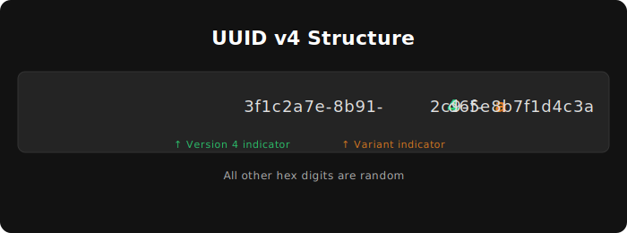

> ⚠️ Choosing the wrong one can hurt your database performance at scale. Sick!

## What is a [UUID](https://en.wikipedia.org/wiki/Universally_unique_identifier)?

UUID is a **Universally Unique Identifier** - a 128-bit number used (as the name suggests) to uniquely identify objects in distributed systems.

There are currently eight versions, but I'm not going to go through all of them. Let’s focus on **v4** and **v7**, as they are the two most popular choices for production environments today.

### UUID v4 - Purely Random

The most common version, consisting almost entirely of random bits.

### UUID v7 - Time-ordered

It combines a Unix timestamp (in milliseconds) with random data. This makes it **sortable**, which is ideal for database primary keys.

---

## (Egghead corner) Random or pseudorandom?

You probably know that functions like `Math.random()` generate [pseudorandom](https://en.wikipedia.org/wiki/Pseudorandomness) numbers. Modern crypto libraries, like the built-in Node.js [crypto](http://nodejs.org/api/crypto.html) or the [uuid](https://www.npmjs.com/package/uuid) package, are much smarter.

They use **Cryptographically Secure Pseudorandom Number Generators ([CSPRNG](https://en.wikipedia.org/wiki/Cryptographically_secure_pseudorandom_number_generator))**, calling OS-level APIs to seed from real entropy based on unpredictable hardware events - like the specific mouse movements created by an unpredictable human (you).

---

## (Egghead corner) Duplication probability?

|                  | UUIDv4         | UUIDv7          |
| ---------------- | -------------- | --------------- |
| Random bits      | 122            | 74              |
| Collision space  | Global         | Per-millisecond |
| Practical safety | Extremely safe | Still very safe |

They won't collide.

128-bit identifiers. To put that in perspective, if you generated 1 million IDs every second for the next 100 years, the probability of a single collision is about 0.0001%.

While UUID v7 replaces some random bits with a timestamp, it still leaves **74 bits of randomness** and that's for one millisecond space! Impossible to reach in real world systems.

## Which one is better?

Both are greeat, but **UUID v7** can offer better performance. Its time-sorted nature is a game-changer for high-performance database inserts (keeping the B-tree index happy).

However, we are talking about scale here. If your table has fewer than 10M rows, the performance boost might be negligible. One advantage of **UUID v4** is that it comes built-in with modern JavaScript via `crypto.randomUUID()`, so you don't need external dependencies (though v7 support will likely be standardized soon).

---

## What about Nano ID?

If you've been around the JavaScript ecosystem, you’ve definitely run into **NanoID**. Here’s how they actually stack up:

| Feature             | UUID (v4/v7)                 | NanoID                            |
| :------------------ | :--------------------------- | :-------------------------------- |
| **Size**            | 36 characters (with dashes)  | 21 characters (default)           |
| **Alphabet**        | Hexadecimal (0-9, a-f)       | URL-friendly (A-Z, a-z, 0-9, \_-) |
| **Standardization** | RFC 9562 (Industry Standard) | Library-specific                  |

It's **smaller and faster**. Because it uses a larger alphabet (64 characters instead of 16), it achieves the same collision resistance as a UUID v4 while being significantly shorter. This makes it the champion for **public-facing URLs** where a long UUID looks clunky.

**Standardization is king.** Most relational databases (like Postgres) have a native `UUID` data type. They store these as 128-bit binary data under the hood, which is much more efficient than storing a NanoID as a `VARCHAR` string.

> **Rule of thumb:** If the ID is going in a URL, use **NanoID**.

## TL;DR

- **Use UUID v7** for modern database primary keys (faster indexing).
- **Use UUID v4** for zero-dependency apps. It’s built into the native crypto API.
- **Use NanoID** for clean, user-friendly URLs.
