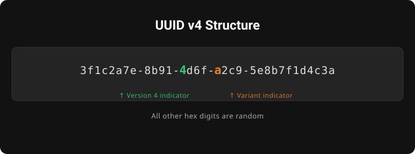
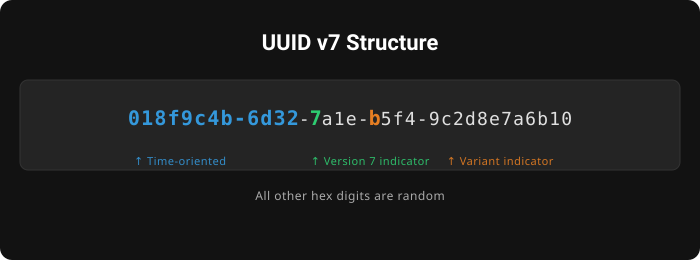

For new database keys, consider **UUID v7** when time ordering and index locality matter. Choose **UUID v4** for simple random IDs with native `crypto.randomUUID()` support, or **Nano ID** for shorter URL-friendly strings. Benchmark your database workload before switching an existing schema; no format is the best choice for every application.

## What is a UUID?

A [Universally Unique Identifier (UUID)](https://en.wikipedia.org/wiki/Universally_unique_identifier) is a 128-bit value designed to uniquely identify resources across distributed systems without requiring a central coordinating authority.

[RFC 9562](https://www.rfc-editor.org/rfc/rfc9562.html) documents the UUID formats. This comparison focuses on UUID v4 and UUID v7, two useful choices for application identifiers.

### UUID v4: Random identifiers

[UUID v4](https://www.rfc-editor.org/rfc/rfc9562.html#section-5.4) has 122 random bits; the other six bits identify the version and variant. With a secure generator, collisions are extremely unlikely at typical application volumes, but uniqueness is still probabilistic.

### UUID v7: Time-ordered identifiers

[UUID v7](https://www.rfc-editor.org/rfc/rfc9562.html#section-5.7) starts with a 48-bit Unix timestamp in milliseconds. Its remaining 74 payload bits can hold random data, or a combination of randomness, sub-millisecond time, and counters.

Values with different timestamps sort by that timestamp. Within the same millisecond, generation order depends on the implementation: random suffixes alone do not guarantee it. Clock rollback and clocks on different machines also matter. The RFC describes [optional monotonicity mechanisms](https://www.rfc-editor.org/rfc/rfc9562.html#section-6.2), so do not treat a UUID as a guaranteed global event sequence.

---

## How UUID generators create secure randomness

Functions like `Math.random()` generate [pseudorandom numbers](https://en.wikipedia.org/wiki/Pseudorandomness) using predictable algorithms, making them unsuitable for secure IDs.

Modern runtimes and libraries – such as the Node.js [crypto module](https://nodejs.org/api/crypto.html) or the [uuid package](https://www.npmjs.com/package/uuid) – rely on [Cryptographically Secure Pseudorandom Number Generators (CSPRNG)](https://en.wikipedia.org/wiki/Cryptographically_secure_pseudorandom_number_generator). These generators call operating system APIs to seed from system entropy gathered from unpredictable hardware events.

---

## Collision probability: Can two UUIDs collide?

| Metric | UUID v4 | UUID v7 with a fully random suffix |
| :--- | :--- | :--- |
| Random bits | 122 | 74 |
| Collision window | All generated IDs | IDs with the same millisecond timestamp |
| Uniqueness | Probabilistic | Probabilistic |

For independent, uniformly random values in a space of size `2^b`, the birthday approximation is `p ≈ 1 − exp(−n(n−1)/(2 × 2^b))`. For UUID v4, generating one million IDs every second for 100 years gives approximately `n = 3.16 × 10^15` and a collision probability of about **0.000094%** with `b = 122`.

For UUID v7 with 74 random bits, apply the same calculation to IDs sharing a timestamp. For example, one million IDs in a single millisecond gives a probability of about **2.6 × 10^-11** for that bucket. Risk accumulates across buckets, and generators that use counters or extra timestamp bits need analysis of their actual construction. The RFC discusses these assumptions in its [collision resistance guidance](https://www.rfc-editor.org/rfc/rfc9562.html#section-6.7).

Keep a unique constraint on database identifiers and handle a duplicate if one occurs. Low collision probability does not replace data integrity checks.

---

## Database index performance: UUID v4 vs. UUID v7

UUID v7 is worth considering for write-heavy tables with B-tree indexes. The RFC identifies [poor index locality](https://www.rfc-editor.org/rfc/rfc9562.html#section-2.1) as a drawback of UUID v4: random values spread inserts across the index instead of grouping recent values together.

UUID v7's timestamp prefix can improve locality by keeping recently generated values close in the index. That can reduce the working set of index pages during inserts. It does **not** eliminate page splits or fragmentation, guarantee higher throughput, or make the table itself physically ordered. PostgreSQL, for example, stores table rows separately from its indexes.

There is no universal row-count threshold where UUID v7 becomes faster. The result depends on index size relative to memory, insert concurrency, database engine, and read/write patterns. Compare insert latency, throughput, index size, and reads using representative data before migrating.

UUID v4 remains a practical choice when random IDs meet your needs, especially when you want the native JavaScript `crypto.randomUUID()` API. In PostgreSQL, both versions use the same [native UUID type](https://www.postgresql.org/docs/current/datatype-uuid.html).

---

## When to use Nano ID

If you work in the JavaScript ecosystem, you have likely encountered [Nano ID](https://github.com/ai/nanoid). Here is how it compares to standard UUIDs:

| Feature | UUID (v4 and v7) | Nano ID |
| :--- | :--- | :--- |
| Size | 36 characters (with hyphens) | 21 characters (default) |
| Alphabet | Hexadecimal (`0-9`, `a-f`) | URL-safe (`A-Z`, `a-z`, `0-9`, `_`, `-`) |
| Standard | RFC 9562 | Library-specific |

Nano ID produces a shorter string for public URLs. Because it uses a 64-character URL-friendly alphabet instead of 16 hexadecimal characters, it provides collision resistance comparable to UUID v4 in 21 characters instead of 36. This compact footprint makes it ideal for public URLs, shareable links, and short codes.

However, relational databases like PostgreSQL provide a native 128-bit `UUID` data type stored efficiently as 16 binary bytes. In contrast, storing a Nano ID requires a `VARCHAR(21)` or `CHAR(21)` column, which stores the identifier as text rather than 16 binary bytes. The total storage cost and index performance depend on the database and schema.

> **Rule of thumb:** Use Nano ID for user-facing URLs and slug parameters. Use UUID for internal primary keys.

---

## Summary: Which identifier should you choose?

- **UUID v7** – Consider for database primary keys when time ordering and B-tree index locality matter. Measure the benefit for your workload.

- **UUID v4** – Choose for internal identifiers in zero-dependency environments. It is built into the native JavaScript `crypto.randomUUID()` API and requires no third-party packages.

- **Nano ID** – Choose for public-facing URLs and shareable IDs where compact strings are useful. Security-sensitive tokens also need sufficient entropy, expiry, and access controls.

Designing a database schema? Read my guide on [how to store money in a database](/posts/store-monetary-values/).
